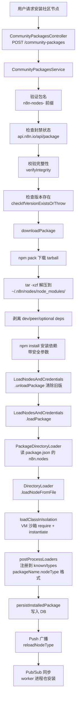
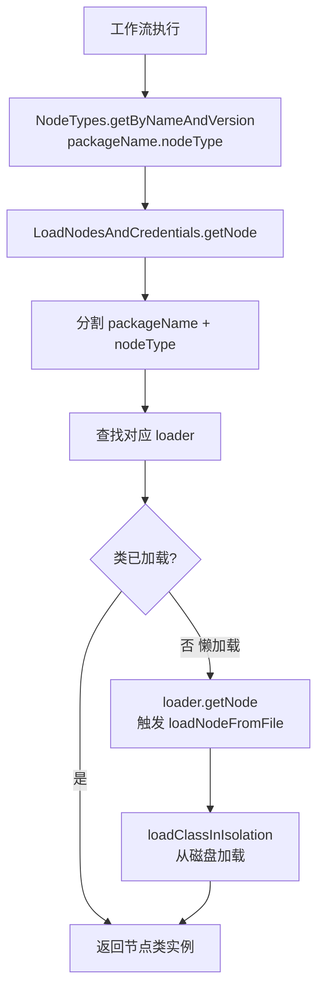

# n8n 社区节点（Community Nodes）安装与加载机制分析

## 1. 安装第三方 npm 包作为节点

### 命名约定

社区节点包必须以 `n8n-nodes-` 为前缀（[community-packages.service.ts:128](../packages/cli/src/modules/community-packages/community-packages.service.ts#L128)）。例如 `n8n-nodes-evolution-api`。支持 scoped 包如 `@scope/n8n-nodes-xxx`。

### package.json 约定

第三方 npm 包在 `package.json` 中必须声明 `n8n` 字段（[types.ts:5-8](../packages/core/src/nodes-loader/types.ts#L5-L8)）：

```json
{
  "name": "n8n-nodes-evolution-api",
  "version": "1.0.0",
  "n8n": {
    "nodes": ["dist/nodes/EvolutionApi/EvolutionApi.node.js"],
    "credentials": ["dist/credentials/EvolutionApi.credentials.js"]
  }
}
```

`n8n.nodes` 和 `n8n.credentials` 是相对路径数组，指向 `.node.js` 和 `.credentials.js` 文件。

### 安装流程

入口是 REST API [community-packages.controller.ts](../packages/cli/src/modules/community-packages/community-packages.controller.ts)，三个端点：

- `POST /community-packages` — 安装
- `PATCH /community-packages` — 更新
- `DELETE /community-packages` — 卸载

**安装详细步骤**（[community-packages.service.ts:384-455](../packages/cli/src/modules/community-packages/community-packages.service.ts#L384-L455)）：

1. **验证包名** — 必须以 `n8n-nodes-` 开头，不含可疑字符
2. **检查封禁状态** — POST 到 `https://api.n8n.io/api/package` 检查是否被禁
3. **校验完整性** — 如果提供了 checksum，调用 `verifyIntegrity()` 比对 npm registry 的 `dist.integrity`
4. **检查版本存在** — `checkIfVersionExistsOrThrow()`
5. **下载包** — `downloadPackage()` 方法（[line 492-542](../packages/cli/src/modules/community-packages/community-packages.service.ts#L492-L542)）：
   - `npm pack <packageName>@<version>` 下载 tarball 到 `~/.n8n/nodes/`
   - `tar -xzf` 解压到 `~/.n8n/nodes/node_modules/<packageName>/`
   - 从 `package.json` 中剥离 `devDependencies/peerDependencies/optionalDependencies`
   - 在包目录内运行 `npm install`（带安全参数：`--bin-links=false --install-strategy=shallow --ignore-scripts=true --package-lock=false`）
   - 更新 `~/.n8n/nodes/package.json` 记录依赖
6. **卸载旧版本** — `LoadNodesAndCredentials.unloadPackage(packageName)`
7. **加载新包** — `LoadNodesAndCredentials.loadPackage(packageName)`
8. **持久化到数据库** — 创建 `InstalledPackages` + `InstalledNodes` 实体记录
9. **刷新类型注册** — `postProcessLoaders()` + `releaseTypes()`
10. **通知前端** — 广播 `reloadNodeType` push 事件
11. **多进程同步** — 发布 pub/sub 命令，让 worker 进程也执行安装

### 配置项

[community-packages.config.ts](../packages/cli/src/modules/community-packages/community-packages.config.ts) 提供环境变量：

| 环境变量 | 默认值 | 作用 |
|---|---|---|
| `N8N_COMMUNITY_PACKAGES_ENABLED` | true | 是否启用社区节点 |
| `N8N_COMMUNITY_PACKAGES_REGISTRY` | https://registry.npmjs.org | npm registry URL |
| `N8N_REINSTALL_MISSING_PACKAGES` | false | 启动时是否自动重装缺失包 |
| `N8N_UNVERIFIED_PACKAGES_ENABLED` | true | 是否允许安装未验证包 |
| `N8N_COMMUNITY_PACKAGES_PREVENT_LOADING` | false | 是否阻止加载社区包 |

---

## 2. 加载 npm 包的代码机制

### 存储位置

社区包安装到 `~/.n8n/nodes/node_modules/<packageName>/`。这个路径由 [community-packages.module.ts:34-42](../packages/cli/src/modules/community-packages/community-packages.module.ts#L34-L42) 的 `loadDir()` 返回，并注册到 `ModuleRegistry.loadDirs` 中。

### 启动时加载流程

[load-nodes-and-credentials.ts:66-106](../packages/cli/src/load-nodes-and-credentials.ts#L66-L106) 的 `init()` 方法：

1. **设置 NODE_PATH** — 确保 `require()` 能从多个路径解析模块
2. **加载内置包** — `n8n-nodes-base` 和 `@n8n/n8n-nodes-langchain`，使用 `LazyPackageDirectoryLoader`
3. **遍历 moduleRegistry.loadDirs** — 包括社区包路径 `~/.n8n/nodes/node_modules`
4. **扫描社区包** — `loadNodesFromNodeModules()`（[line 163-190](../packages/cli/src/load-nodes-and-credentials.ts#L163-L190)）用 glob 匹配 `n8n-nodes-*` 和 `@*/n8n-nodes-*`
5. **加载自定义目录** — `N8N_CUSTOM_EXTENSIONS` 环境变量或 `~/.n8n/custom`
6. **后处理** — `postProcessLoaders()` 汇总所有 loader

### 四种 Loader 类

| Loader | 用途 | 加载策略 |
|---|---|---|
| `PackageDirectoryLoader` | npm 包（社区节点） | 读 `package.json` 的 `n8n.nodes/credentials` |
| `LazyPackageDirectoryLoader` | 内置包（优化启动） | 优先读 `dist/known/*.json` 和 `dist/types/*.json`，按需加载类 |
| `CustomDirectoryLoader` | 自定义扩展目录 | glob 扫描 `**/*.node.js` 和 `**/*.credentials.js` |
| `DirectoryLoader`（基类） | 所有 loader 的父类 | 提供 `loadNodeFromFile()` / `loadCredentialFromFile()` |

### PackageDirectoryLoader 的加载过程

[package-directory-loader.ts:27-55](../packages/core/src/nodes-loader/package-directory-loader.ts#L27-L55)：

1. 读取 `package.json`
2. 从 `n8n.nodes` 数组逐个调用 `loadNodeFromFile(nodePath)`
3. 从 `n8n.credentials` 数组逐个调用 `loadCredentialFromFile(credentialPath)`
4. 推断 `supportedNodes` 关系

### 类加载的隔离机制

[directory-loader.ts:147-160](../packages/core/src/nodes-loader/directory-loader.ts#L147-L160) 的 `loadClass()` 调用 [load-class-in-isolation.ts](../packages/core/src/nodes-loader/load-class-in-isolation.ts)：

```typescript
const context = createContext({ require });
const script = new Script(`new (require('${filePath}').${className})()`);
return script.runInContext(context) as T;
```

**关键设计**：社区节点的类在 **VM 沙箱** 中加载，与主进程隔离。每个类通过 `new (require(filePath).className)()` 实例化。测试环境下跳过隔离，直接用 `require`。

### 懒加载机制

`LazyPackageDirectoryLoader`（[lazy-package-directory-loader.ts](../packages/core/src/nodes-loader/lazy-package-directory-loader.ts)）：

- 先尝试读取预构建的 `dist/known/nodes.json`、`dist/types/nodes.json` 等文件
- 如果存在，只加载类型描述（`INodeTypeDescription`），不加载类实现
- 实际的节点类在 `getNode()` 被调用时才按需加载（[directory-loader.ts:239-254](../packages/core/src/nodes-loader/directory-loader.ts#L239-L254))
- 如果预构建 JSON 不存在，回退到 `super.loadAll()`（全量加载）

### 节点命名空间

所有节点类型名称都以 `packageName.nodeType` 格式注册（[load-nodes-and-credentials.ts:506-511](../packages/cli/src/load-nodes-and-credentials.ts#L506-L511)）。例如社区包 `n8n-nodes-evolution-api` 中的 `EvolutionApi` 节点，完整名称为 `n8n-nodes-evolution-api.EvolutionApi`。

### 运行时节点解析

当工作流执行时：

1. 调用 `NodeTypes.getByNameAndVersion('n8n-nodes-evolution-api.EvolutionApi', 1)`
2. 委托到 `LoadNodesAndCredentials.getNode()`（[line 595-610](../packages/cli/src/load-nodes-and-credentials.ts#L595-L610))
3. 分割为 `packageName` 和 `nodeType`
4. 查找对应 loader
5. 如果类未加载（懒加载状态），`loader.getNode()` 触发 `loadNodeFromFile()` 从磁盘加载
6. 返回实例化的节点类

### 内存优化

`releaseTypes()` 方法（[line 112-117](../packages/cli/src/load-nodes-and-credentials.ts#L112-L117))释放所有类型描述占用的内存。在社区包安装/更新后调用，之后需要类型时 `collectTypes()` 会重新加载。

---

## 3. 整体架构流程图



```mermaid
flowchart TD
    S[n8n 启动] --> S1[LoadNodesAndCredentials.init]
    S1 --> S2[设置 NODE_PATH\n确保 require 能解析]
    S2 --> S3[加载内置包\nn8n-nodes-base\n@n8n/n8n-nodes-langchain\nLazyPackageDirectoryLoader]
    S3 --> S4[遍历 moduleRegistry.loadDirs\n含 ~/.n8n/nodes/node_modules]
    S4 --> S5[glob 扫描\nn8n-nodes-* 和 @*/n8n-nodes-*]
    S5 --> S6[每个包创建\nLazyPackageDirectoryLoader\n或 PackageDirectoryLoader]
    S6 --> S7[加载自定义目录\nN8N_CUSTOM_EXTENSIONS\n或 ~/.n8n/custom]

    S7 --> S8[postProcessLoaders\n汇总所有 loader\n为节点名加包前缀]
    S8 --> S9[CommunityPackagesService.init\n检查缺失包\n可选自动重装]
```



---

## 4. 关键源码文件索引

| 文件 | 作用 |
|---|---|
| `packages/cli/src/modules/community-packages/community-packages.controller.ts` | REST API 控制器 |
| `packages/cli/src/modules/community-packages/community-packages.service.ts` | 安装/更新/卸载核心逻辑 |
| `packages/cli/src/modules/community-packages/community-packages.module.ts` | 模块注册，提供 loadDir |
| `packages/cli/src/modules/community-packages/community-packages.config.ts` | 配置项 |
| `packages/cli/src/modules/community-packages/npm-utils.ts` | npm 命令执行、完整性校验 |
| `packages/cli/src/modules/community-packages/installed-packages.entity.ts` | DB 实体 |
| `packages/cli/src/modules/community-packages/installed-nodes.entity.ts` | DB 实体 |
| `packages/cli/src/load-nodes-and-credentials.ts` | 节点加载主协调器 |
| `packages/cli/src/node-types.ts` | 运行时节点类型查找 |
| `packages/core/src/nodes-loader/directory-loader.ts` | Loader 基类 |
| `packages/core/src/nodes-loader/package-directory-loader.ts` | npm 包 Loader |
| `packages/core/src/nodes-loader/lazy-package-directory-loader.ts` | 懒加载 Loader |
| `packages/core/src/nodes-loader/custom-directory-loader.ts` | 自定义目录 Loader |
| `packages/core/src/nodes-loader/load-class-in-isolation.ts` | VM 沙箱类加载 |